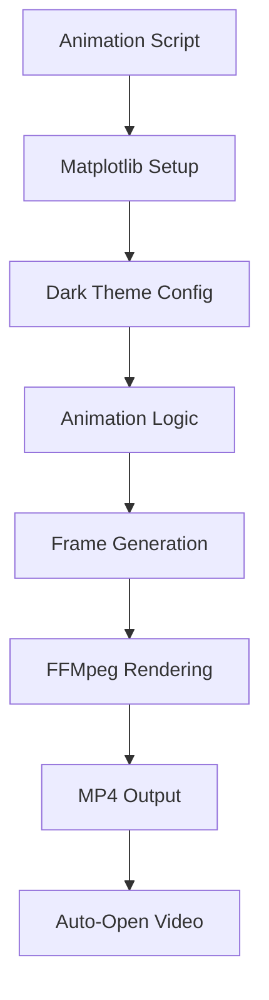
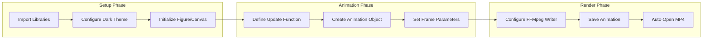
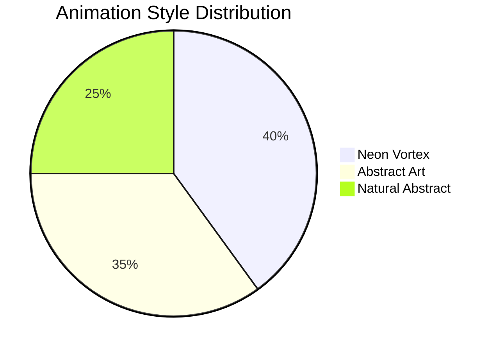
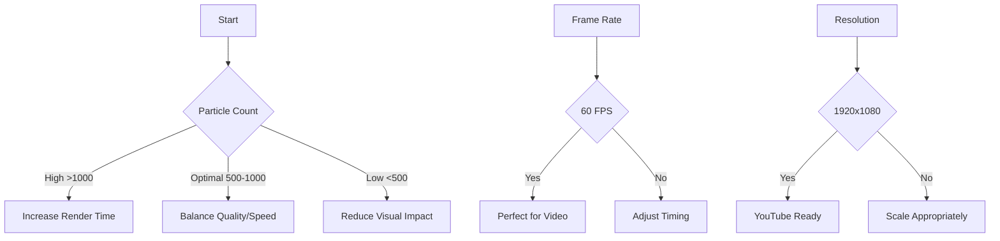

# 🎨 AI Animations

[](https://www.python.org/)
[](https://matplotlib.org/)
[](LICENSE)
[](https://github.com/Kedhareswer/Synthetic_Data_Generator)

> ✨ A collection of mesmerizing Python Matplotlib animations designed for YouTube videos and documentaries. Create stunning visual experiences with modern dark themes, vibrant colors, and hypnotic effects that captivate viewers.

## 📋 Table of Contents

- [🎯 Project Overview](#-project-overview)
- [🌟 Key Features](#-key-features)
- [📊 Animation Workflow](#-animation-workflow)
- [🛠️ Requirements](#️-requirements)
- [🚀 Quick Start](#-quick-start)
- [🎭 Animation Styles](#-animation-styles)
- [📝 Creating New Animations](#-creating-new-animations)
- [💡 Best Practices](#-best-practices)
- [📚 Examples](#-examples)
- [🤝 Contributing](#-contributing)
- [📄 License](#-license)

## 🎯 Project Overview

This repository showcases the power of **Matplotlib animations** for creating engaging visual content. Each script generates unique animation styles optimized for video platforms, focusing on:

- 🎨 **Visual Appeal**: Modern aesthetics with dark backgrounds and neon accents
- ⚡ **Performance**: 60 FPS rendering for smooth playback
- 📺 **Platform Ready**: MP4 output perfect for YouTube and documentaries
- 🎪 **Entertainment Focus**: Hypnotic effects designed to maintain viewer attention

### Architecture Overview



## 🌟 Key Features

| Feature | Description | Benefit |
|---------|-------------|---------|
| 🎨 **Modern Design** | Dark backgrounds with vibrant neon colors | Eye-catching and professional look |
| ⚡ **High Performance** | 60 FPS output with optimized rendering | Smooth playback on all devices |
| 📐 **Centered Focus** | Content positioned for optimal viewing | Perfect for YouTube's 16:9 format |
| 🎭 **Entertainment-First** | Hypnotic effects and smooth pacing | Keeps viewers engaged |
| 🚫 **No Text Overlays** | Pure visual content | Seamless integration into videos |
| 📹 **MP4 Ready** | Direct upload to video platforms | No additional processing needed |

## 📊 Animation Workflow



## 🛠️ Requirements

### System Requirements

| Component | Version | Purpose |
|-----------|---------|---------|
| 🐍 **Python** | 3.7+ | Core runtime |
| 📊 **Matplotlib** | 3.0+ | Animation engine |
| 🔢 **NumPy** | 1.18+ | Mathematical computations |
| 🎬 **FFmpeg** | Latest | Video encoding |
| 📦 **static_ffmpeg** | Latest | FFmpeg integration |

### Installation

```bash
# Install Python dependencies
pip install matplotlib numpy static_ffmpeg

# Install FFmpeg (system-dependent)
# Windows: Download from https://ffmpeg.org/download.html
# macOS: brew install ffmpeg
# Linux: sudo apt install ffmpeg
```

### Verification

```bash
python -c "import matplotlib, numpy; print('✅ Dependencies installed')"
ffmpeg -version  # Should show version info
```

## 🚀 Quick Start

### Basic Usage

1. **Clone the repository**
   ```bash
   git clone https://github.com/Kedhareswer/ai-animation.git
   cd Synthetic_Data_Generator
   ```

2. **Run an animation**
   ```bash
   python ChatGPT/main.py
   ```

3. **View results**: The MP4 file will automatically open after rendering

### Expected Output

- 🎬 **Video File**: `animation.mp4` (or custom name)
- 📊 **Resolution**: 1920x1080 (16:9 aspect ratio)
- ⚡ **Frame Rate**: 60 FPS
- ⏱️ **Duration**: Variable (typically 10-20 seconds)

## 🎭 Animation Styles

| Style | Description | Key Elements | Use Case |
|-------|-------------|--------------|----------|
| 🌪️ **Neon Vortex** | Spiral particle system with pulsing rings | Dynamic colors, orbital motion | Hypnotic backgrounds |
| 🎨 **Abstract Art** | Flowing lines and geometric shapes | Color transitions, particle trails | Artistic visualizations |
| 🌿 **Natural Abstract** | Organic patterns with smooth transitions | Wave functions, attractor fields | Nature-inspired content |

### Style Comparison



## 📝 Creating New Animations

### Core Requirements Checklist

- [ ] Use `FuncAnimation` or `ArtistAnimation`
- [ ] Set `plt.style.use("dark_background")`
- [ ] Configure 60 FPS with `FFMpegWriter(fps=60)`
- [ ] Center content in 16:9 frame
- [ ] Implement vibrant color schemes
- [ ] Ensure smooth pacing (test timing)
- [ ] Maintain stylistic consistency
- [ ] No text overlays (unless specified)
- [ ] Generate MP4 output

### Template Structure

```python
import matplotlib.pyplot as plt
from matplotlib.animation import FuncAnimation, FFMpegWriter
import numpy as np

# 🎨 Dark theme configuration
plt.style.use("dark_background")
plt.rcParams.update({
    "figure.facecolor": "#0a0a0f",
    "axes.facecolor": "#0a0a0f",
    "axes.edgecolor": "#0a0a0f",
    "savefig.facecolor": "#0a0a0f",
    "lines.antialiased": True,
})

# 📐 Canvas setup (16:9 for YouTube)
fig, ax = plt.subplots(figsize=(16, 9), dpi=120)
ax.set_aspect("equal")
ax.axis("off")
ax.set_xlim(-1.05, 1.05)
ax.set_ylim(-1.05, 1.05)

# 🎭 Animation parameters
FPS = 60
DURATION_SEC = 12
FRAMES = FPS * DURATION_SEC

# ✨ Your creative animation logic here
def update(frame):
    t = frame / FPS
    # Update visual elements
    # Return artists for blitting
    return artists

# 🎬 Render animation
ani = FuncAnimation(
    fig, update, frames=FRAMES,
    init_func=lambda: update(0),
    blit=True, interval=1000/FPS
)

# 💾 Save as MP4
writer = FFMpegWriter(fps=FPS, codec="libx264")
ani.save("output.mp4", writer=writer)
plt.close(fig)

# 🔍 Auto-open for review
import os
os.startfile("output.mp4")  # Windows
# or subprocess.call(["open", "output.mp4"])  # macOS
```

## 💡 Best Practices

### 🎨 Design Principles

| Principle | Implementation | Impact |
|-----------|----------------|--------|
| **Color Psychology** | Vibrant, theme-matching colors | Emotional engagement |
| **Pacing** | Smooth transitions, optimal timing | Viewer retention |
| **Consistency** | Unified visual style | Professional appearance |
| **Focus** | Centered, clear focal points | Better comprehension |

### ⚡ Performance Optimization



### 📏 Quality Metrics

- **Render Time**: Balance detail vs. speed
- **File Size**: Optimize for web delivery
- **Visual Flow**: Ensure smooth motion
- **Color Harmony**: Consistent palette usage

## 📚 Examples

### 🎭 Available Animations

| Directory | Script | Style | Output | Description |
|-----------|--------|-------|--------|-------------|
| `ChatGPT/` | `main.py` | Neon Vortex | `animation.mp4` | Particle spiral with pulsing rings |
| `Anthropic/` | `01.py` | Abstract Art | `abstract_art_animation.mp4` | Flowing lines and geometric shapes |
| `Anthropic/` | `02.py` | Natural Abstract | `natural_abstract_animation.mp4` | Organic patterns and transitions |

### 🎬 Sample Output Specifications

| Property | Value | Notes |
|----------|-------|-------|
| **Resolution** | 1920×1080 | 16:9 aspect ratio |
| **Frame Rate** | 60 FPS | Smooth video playback |
| **Codec** | H.264 | Universal compatibility |
| **Duration** | 10-20s | Optimal attention span |
| **File Size** | 5-50MB | Web-optimized |

### 📊 Performance Benchmarks

```
Animation Type    | Particles | Render Time | File Size
------------------|-----------|-------------|----------
Neon Vortex       | 1400      | ~2-3 min    | ~15MB
Abstract Art      | 150       | ~1-2 min    | ~8MB
Natural Abstract  | 200       | ~1-2 min    | ~10MB
```

## 🤝 Contributing

### 📋 Contribution Guidelines

1. **Fork** the repository
2. **Create** a feature branch: `git checkout -b feature/amazing-animation`
3. **Follow** the animation creation standards
4. **Test** thoroughly: `python your_script.py`
5. **Document** your animation in the README
6. **Submit** a pull request

### 🔧 Development Setup

```bash
# Clone and setup
git clone https://github.com/Kedhareswer/Synthetic_Data_Generator.git
cd Synthetic_Data_Generator
pip install -r requirements.txt  # If available

# Run tests
python -m pytest tests/  # If test suite exists
```

### 📝 Pull Request Template

- [ ] Animation follows project standards
- [ ] Dark theme implemented
- [ ] 60 FPS output confirmed
- [ ] MP4 generation tested
- [ ] Documentation updated
- [ ] Performance optimized

## 📄 License

[](https://opensource.org/licenses/MIT)

This project is licensed under the **MIT License** - see the [LICENSE](LICENSE) file for details.

---

<div align="center">

**Made with ❤️ for the animation community**

[⭐ Star us on GitHub](https://github.com/Kedhareswer/Synthetic_Data_Generator) • [📧 Report Issues](https://github.com/Kedhareswer/Synthetic_Data_Generator/issues) • [📖 Documentation](https://github.com/Kedhareswer/Synthetic_Data_Generator/wiki)

</div>
